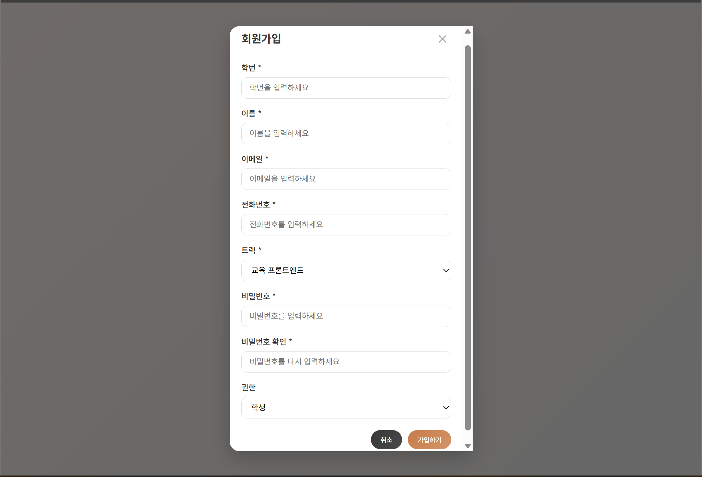
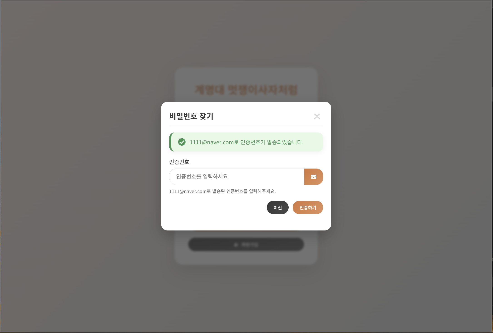
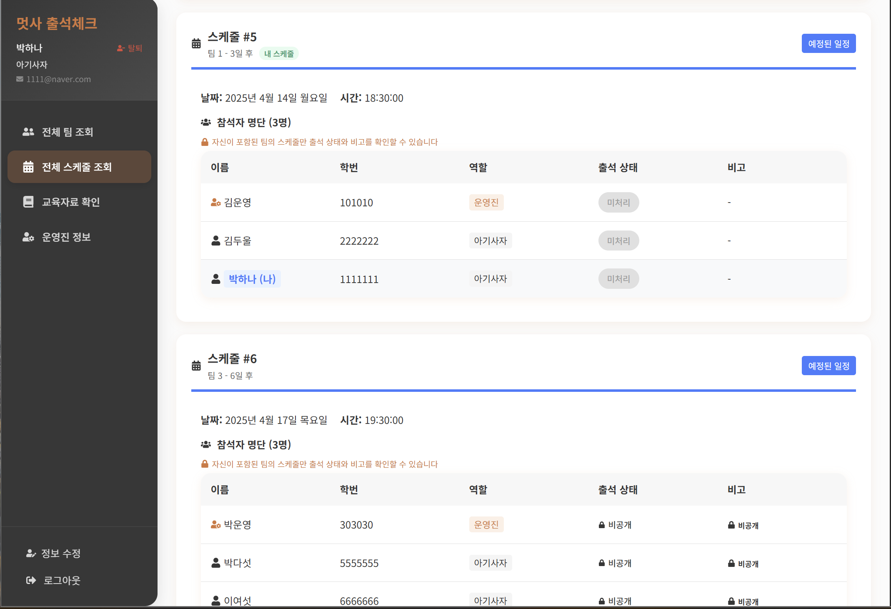
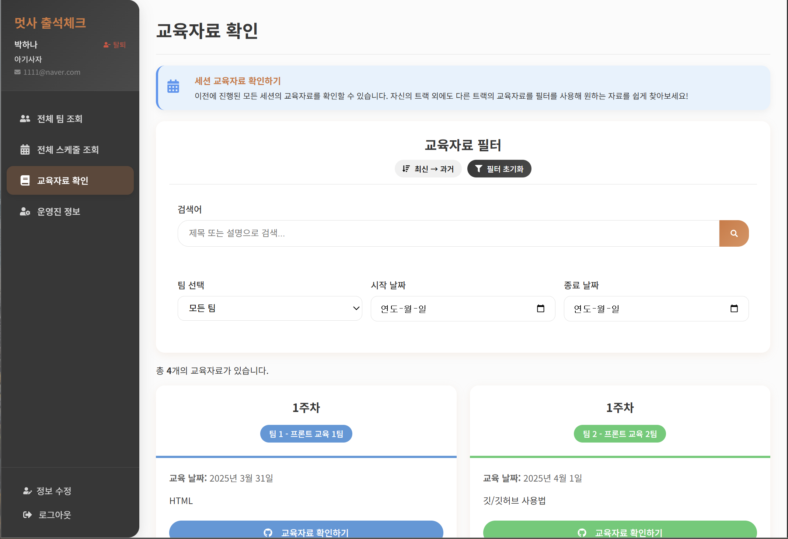
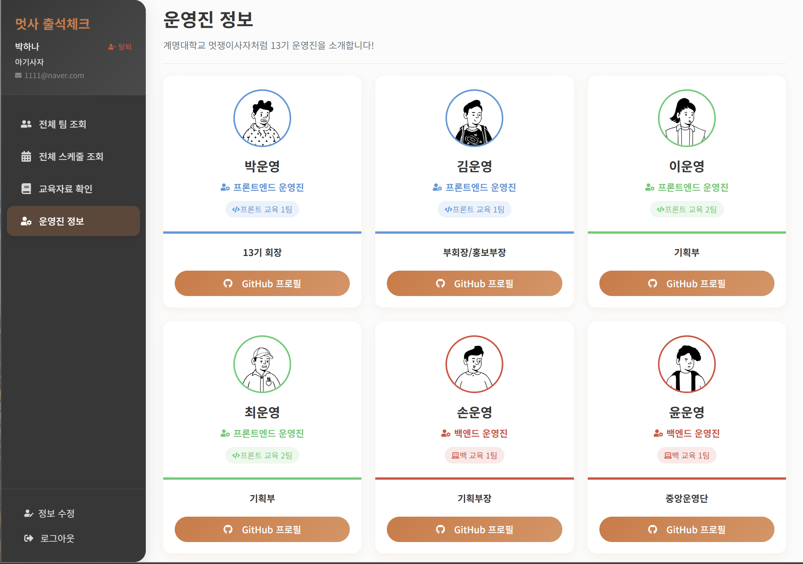
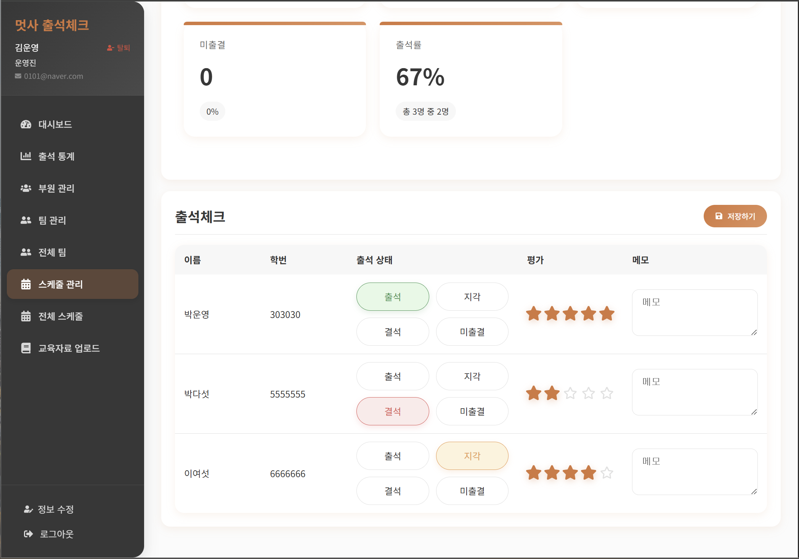
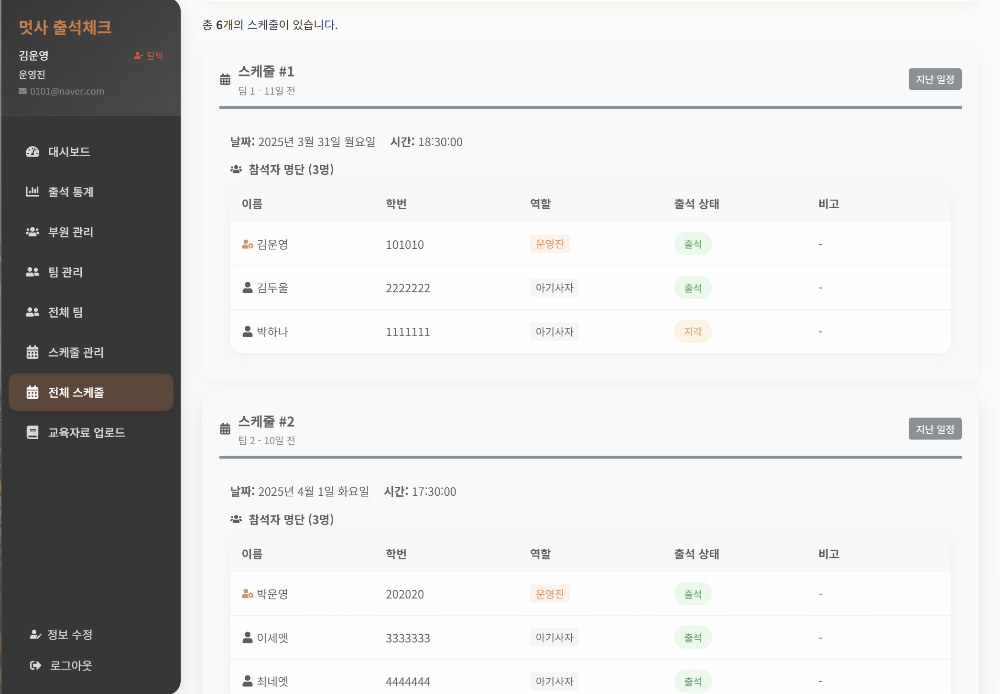

# 🦁 계명대학교 멋쟁이사자처럼 출석 관리 시스템

  
  
   

  

    
    
    
  

## 📋 프로젝트 개요

멋쟁이사자처럼 13기 운영을 위한 출석 관리 시스템으로, 팀 관리, 부원 관리, 스케줄 관리, 출석 체크 및 통계 분석 기능을 제공.
  
운영진과 아기사자를 위한 별도의 인터페이스를 제공하여 역할에 맞는 다양한 기능 사용가능.

## 🛜 접속 링크

멋사 13기 출석 관리 시스템 : <a href="https://likelion-13th-att.netlify.app" target="_blank">https://likelion-13th-att.netlify.app</a>

## 👨‍💻 개발팀

<table>
  <tr>
    <td align="center">
      <a href="https://github.com/ganglike248">
         
        <b>손경락</b>
      </a> 
      프론트엔드  
      
      
    </td>
    <td align="center">
      <a href="https://github.com/hdg5639">
         
        <b>한동균</b>
      </a> 
      백엔드  
      
      
    </td>
  </tr>
</table>

## 🛠️ 기술 스택

### 프론트엔드

  
  
  
  
  

### 백엔드

  
  
  
  

## 🚀 주요 기능

### 1. 인증 시스템 🔐
- 권한별 사용자 접근 제어 (운영진/학생)
- 회원가입 및 로그인

### 2. 학생 페이지 👨‍🎓

#### 전체 팀 조회 👥
- 모든 팀과 팀원 정보 확인
- 팀원 역할 및 트랙 정보 확인
- 팀별 검색 기능

#### 전체 스케줄 조회 📆
- 팀별 스터디 일정 확인
- 자신의 팀의 출석 상태 및 참석자 목록 확인(타팀 출석 상태 비공개)
- 지난 스케줄과 예정 스케줄 토글 필터링 기능
- 날짜별, 팀별 필터링 기능

#### 교육자료 확인 📚
- 팀별 교육자료 조회
- 교육 날짜 및 설명 확인
- GitHub 링크를 통한 교육자료 열람

#### 운영진 정보 💼
- 운영진 프로필 사진 및 이름 확인
- 운영진 담당 역할 및 트랙 정보
- GitHub 프로필 링크 연결

### 3. 운영진 페이지 👨‍💼

#### 대시보드 📊
- 주요 통계 및 다가오는 일정 확인
- 팀별 출석률 차트
- 최근 등록된 팀 목록
- 다가오는 스케줄 목록

#### 통계 리포트 📈
- 전체 출석 현황 통계
- 팀별 출석률 비교
- 스케줄별 출석 현황
- 부원별 출석 현황
- 다양한 차트를 통한 시각화

#### 부원 관리 👤
- 부원 상세 정보 조회
- 이름, 학번, 연락처, 트랙 등 확인 가능

#### 팀 관리 👥
- 팀 생성, 수정, 삭제
- 팀원 추가/제거
- 팀별 스케줄 관리
- 팀 통계 정보 확인

#### 전체 팀 조회 👥
- 모든 팀과 팀원 정보 확인
- 팀원 역할 및 트랙 정보 확인
- 팀별 검색 기능

#### 스케줄 관리 📅
- 일정 생성, 수정, 삭제
- 스케줄별 출석 체크
- 출석 상태 관리 (출석, 지각, 결석, 미처리)
- 개인별 평가 점수 기록

#### 전체 스케줄 조회 📆
- 팀별 스터디 일정 확인
- 출석 상태 및 참석자 목록 확인
- 지난 스케줄과 예정 스케줄 토글 필터링 기능
- 날짜별, 팀별 필터링 기능

#### 교육자료 관리 📝
- 교육자료 업로드/수정/삭제
- 제목, 팀, 교육 날짜, 설명, 깃허브 링크 게시
- 팀별 교육자료 관리
- 날짜별 교육자료 검색
- GitHub 링크 연동

## 📱 주요 기능

### 로그인/회원가입 페이지

- 학번과 비밀번호를 이용한 로그인
- 회원가입 기능
- 권한별(운영진/아기사자) 페이지 리디렉션
---

### 비밀번호 변경 페이지

- 학번과 이메일을 이용한 이메일 인증번호 기반 비밀번호 변경
---

### 학생 페이지

#### 전체 팀 조회

#### 전체 스케줄 조회(학생)

#### 교육자료 확인

#### 운영진 정보

---

### 운영진 페이지

#### 대시보드

#### 출석 통계

#### 부원 관리

#### 팀 관리

#### 전체 팀

#### 스케줄 관리

#### 전체 스케줄(운영진)

#### 교육자료 업로드

## 💻 시스템 요구사항

  
  
  
  

- 모던 웹 브라우저
- 인터넷 연결
- 모바일/태블릿 지원 (반응형 디자인)

## 🛣️ 개발 로드맵

  <table style="width: 80%;">
    <tr>
      <th>버전</th>
      <th>날짜</th>
      <th>주요 기능</th>
    </tr>
    <tr>
      <td><b>v1.0.0</b></td>
      <td>2025.03.17</td>
      <td>로그인/회원가입, 멤버 관리, 팀 생성 및 조회 기능 구현</td>
    </tr>
    <tr>
      <td><b>v1.0.1</b></td>
      <td>2025.03.17</td>
      <td>UI 개선, 회원 정보 확장(전화번호, 트랙), 팀 정보 확장(팀 설명)</td>
    </tr>
    <tr>
      <td><b>v1.0.3</b></td>
      <td>2025.04.01</td>
      <td>스케줄 관리 탭 및 스케줄 생성 기능 추가</td>
    </tr>
    <tr>
      <td><b>v1.1.0</b></td>
      <td>2025.04.07</td>
      <td>대시보드, 팀 페이지 개선, 출석 통계, 학생 페이지 기능 강화</td>
    </tr>
    <tr>
      <td><b>v1.1.1</b></td>
      <td>2025.04.08</td>
      <td>API 버그 수정, 학생 페이지에 '운영진 정보' 탭 추가</td>
    </tr>
    <tr>
      <td><b>v1.1.2</b></td>
      <td>2025.04.08</td>
      <td>교육자료 탭 추가 (운영진: 관리, 학생: 조회), 필터 기능 구현</td>
    </tr>
    <tr>
      <td><b>v1.2.0</b></td>
      <td>2025.04.09</td>
      <td>모바일 CSS 최적화, 교육자료 UI 개선, 전체 버튼 디자인 통일</td>
    </tr>
    <tr>
      <td><b>v1.2.1</b></td>
      <td>2025.04.09</td>
      <td>PWA 지원 및 앱 아이콘 추가 완료</td>
    </tr>
    <tr>
      <td><b>v1.2.2</b></td>
      <td>2025.04.09</td>
      <td>Netlify 배포 완료 및 리드미 수정</td>
    </tr>
    <tr>
      <td><b>v1.2.3</b></td>
      <td>2025.04.10</td>
      <td>새로고침 시 403 에러 수정, 탈퇴 기능 추가, 각종 CSS 수정</td>
    </tr>
    <tr>
      <td><b>v1.3.0</b></td>
      <td>2025.04.12</td>
      <td>백엔드 서버 대거 수정, api 로그 비공개, 학생 페이지 타팀 출결 조회 비공개, 학생 페이지 설명 추가, 이메일 정보 추가, 정보 수정 기능 추가, 이메일 인증 기반 비밀번호 찾기 기능 추가, 프로젝트명/아이콘 수정, 리드미 수정</td>
    </tr>
    <tr>
      <td><b>v1.3.1</b></td>
      <td>2025.04.12</td>
      <td>메인화면 수정, 스크롤 유지 문제 해결</td>
    </tr>
    <tr>
      <td><b>v1.3.2</b></td>
      <td>2025.04.13</td>
      <td>팀 생성 및 수정 모달 필터 추가</td>
    </tr>
    <tr>
      <td><b>v1.3.3</b></td>
      <td>2025.04.14</td>
      <td>업데이트 미반영 문제 해결</td>
    </tr>
    <tr>
      <td><b>v1.3.4</b></td>
      <td>2025.04.14</td>
      <td>자동 로그아웃 기능 추가</td>
    </tr>
    <tr>
      <td><b>v1.3.5</b></td>
      <td>2025.04.14</td>
      <td>교육자료 정렬 수정</td>
    </tr>
  </table>

---

  © 2025 계명대학교 멋쟁이사자처럼 13기 
  

